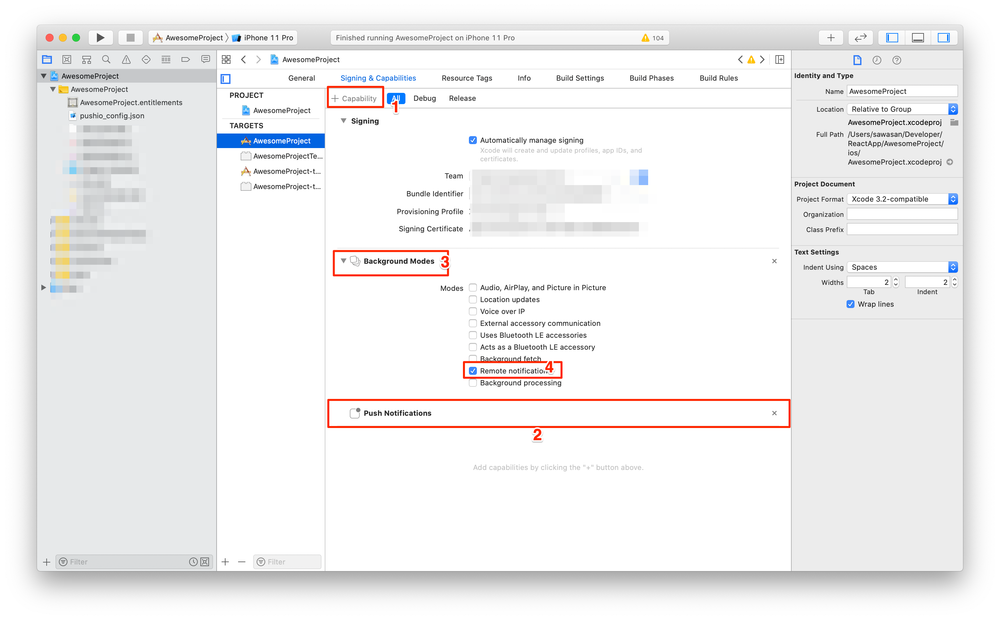

# React Native Module for Responsys SDK

This module makes it easy to integrate your React Native based mobile app with the Responsys SDK. 

## Table of Contents
- [Requirements](#requirements)
  * [For Android](#for-android)
  * [For iOS](#for-ios)
- [Setup](#setup)
  * [For Android](#for-android-1)
  * [For iOS](#for-ios-1)
- [Installation](#installation)
  * [For Android](#for-android-3)
  * [For iOS](#for-ios-3)
- [Integration](#integration)
  * [For Android](#for-android-2)
  * [For iOS](#for-ios-2)
- [Usage](#usage)
  * [Configure And Register](#configure-and-register)
  * [User Identification](#user-identification)
  * [Engagements And Conversion](#engagements-and-conversion)
  * [In-App Messages](#in-app-messages)
  * [Message Center](#message-center)
  * [Geofences And Beacons](#geofences-and-beacons)
  * [Notification Preferences](#notification-preferences)
- [Upgrades](#upgrades)
  * [6.50.1 to 6.51] (#upgrade_6.51)
- [Support](#support)
- [License](#license)


## Requirements

- React Native >= 0.61.5
- React Native CLI >= 2.0.1

### For Android
- Android SDK Tools >= 28.0.3

### For iOS
- iOS 11 or later

## Setup

Before installing the plugin, you must setup your app to receive push notifications.

### For Android
- [Get FCM Credentials](https://docs.oracle.com/en/cloud/saas/marketing/responsys-develop-mobile/android/gcm-credentials) 
- Log in to the [Responsys Mobile App Developer Console](https://docs.oracle.com/en/cloud/saas/marketing/responsys-develop-mobile/dev-console/login/) and enter your FCM credentials (Project ID and Server API Key) for your Android app.
- Get the `pushio_config.json` file generated from your credentials and place it in your project's `android/app/src/main/assets` folder. You might have to create the directory if it is not already present.


### For iOS
- [Generate Auth Key](https://docs.oracle.com/en/cloud/saas/marketing/responsys-develop-mobile/ios/auth-key/) 
- Log in to the [Responsys Mobile App Developer Console](https://docs.oracle.com/en/cloud/saas/marketing/responsys-develop-mobile/dev-console/login/) and enter your Auth Key and other details for your iOS app.
- Download the `pushio_config.json` file generated from your credentials.
- ***Important:*** Copy  `PushIOManager.framework` and place it in the plugin `YOUR_APP_DIR/ios/framework/` folder **before adding plugin to project**. 


## Installation

The plugin can be installed with the React Native CLI,

```shell
cd <your_react_native_app>
yarn add @oracle/react-native-pushiomanager
```

### For Android
- Create a new directory  - `PushIOManager` inside your app's `android` directory.
- Download the SDK native binary from [here](https://www.oracle.com/downloads/applications/cx/responsys-mobile-sdk.html) and place the .aar file in this `android/PushIOManager/` directory.
- Inside the `android/PushIOManager` directory, create a file `build.gradle` with the following code:

	```gradle
	configurations.maybeCreate("default")
	artifacts.add("default", file('PushIOManager-6.51.aar')
	```		

- Add the following to your project-wide `settings.gradle` file:

	```gradle
	include ':PushIOManager'
	project(':PushIOManager').projectDir = new File(rootProject.projectDir, './PushIOManager')
	```


### For iOS
After installing plugin you need to install cocoapods,

- Go to `ios` directory of you app, `cd YOUR_APP_DIR/ios/`
- Run `pod install`
    
    
***Note:*** This step will fail if `PushIOManager.framework` is not available in `YOUR_APP_DIR/ios/framework/` folder **before adding plugin to project with `npm` or `yarn`**. Copy the `PushIOManager.framework` to `YOUR_APP_DIR/ios/framework/` and perform `Installation` step again.


## Integration

### For Android

- Open the `build.gradle` file located in `android/app/` and add the following dependency,
	```
	implementation 'com.google.firebase:firebase-messaging:17.3.0' 
	```

- Open the `AndroidManifest.xml` file located in `android/app/src/main` and add the following,
	* Permissions above the `<application>` tag,

		```xml
		<uses-permission android:name="android.permission.ACCESS_FINE_LOCATION" />
		<uses-permission android:name="${applicationId}.permission.PUSHIO_MESSAGE" />
		<uses-permission android:name="${applicationId}.permission.RSYS_SHOW_IAM" />
		<permission android:name=".permission.PUSHIO_MESSAGE" android:protectionLevel="signature" />
		<permission android:name="${applicationId}.permission.RSYS_SHOW_IAM" android:protectionLevel="signature" />
		```
	
	* Intent-filter for launching app when the user taps on a push notification. Add it inside the `<activity>` tag of `MainActivity`,

		```xml
		<intent-filter>
			<action android:name="${applicationId}.NOTIFICATIONPRESSED" />
	   		<category android:name="android.intent.category.DEFAULT" />
		</intent-filter>
		```
		
	* Add the following code inside `<application>` tag,

		```xml
		 <receiver android:enabled="true" android:exported="false" android:name="com.pushio.manager.PushIOUriReceiver">
            <intent-filter>
                <action android:name="android.intent.action.VIEW" />
                <category android:name="android.intent.category.DEFAULT" />
                <data android:scheme="@string/uri_identifier" />
            </intent-filter>
        </receiver>
        <activity android:name="com.pushio.manager.iam.ui.PushIOMessageViewActivity" android:permission="${applicationId}.permission.SHOW_IAM" android:theme="@android:style/Theme.Translucent.NoTitleBar">
            <intent-filter>
                <action android:name="android.intent.action.VIEW" />
                <category android:name="android.intent.category.BROWSABLE" />
                <category android:name="android.intent.category.DEFAULT" />
                <data android:scheme="@string/uri_identifier" />
            </intent-filter>
        </activity>
		```
	* (Optional) Intent-filter for [Android App Links](https://developer.android.com/training/app-links) setup. Add it inside the `<activity>` tag of `MainActivity`,

		```xml
		<intent-filter android:autoVerify="true">
			<action android:name="android.intent.action.VIEW" />
			<category android:name="android.intent.category.DEFAULT" />
			<category android:name="android.intent.category.BROWSABLE" />
			<data android:host="@string/app_links_url_host" android:pathPrefix="/pub/acc" android:scheme="https" />
       </intent-filter>
		```
		

- Open the `strings.xml` file located at `android/app/src/main/res/values` and add the following properties,

	* Custom URI scheme for displaying In-App Messages and Rich Push content,

		```xml
		<string name="uri_identifier">pio-YOUR_API_KEY</string>
		```
	You can find the API key in the `pushio_config.json` that was placed in `android/app/src/main/assets` earlier during setup.
		
	* (Optional) If you added the `<intent-filter>` for Android App Links in the steps above, then you will need to declare the domain name,
	
		```xml
		<string name="app_links_url_host">YOUR_ANDROID_APP_LINKS_DOMAIN</string>
		```


### For iOS
- Open the Xcode project workspace in your `ios` directory of cordova app. 
- Drag and Drop your `pushio_config.json` in Xcode project.
- Select the root project and Under Capabilites add the "Push Notifications" and "Background Modes". 


- Implement the below delegate methods in `AppDelegate.m`. 

```
- (void)application:(UIApplication *)application didRegisterForRemoteNotificationsWithDeviceToken:
    (NSData *)deviceToken
{
    [[PushIOManager sharedInstance]  didRegisterForRemoteNotificationsWithDeviceToken:deviceToken];
}

- (void)application:(UIApplication *)application didFailToRegisterForRemoteNotificationsWithError:(NSError *)error
{
    [[PushIOManager sharedInstance]  didFailToRegisterForRemoteNotificationsWithError:error];
}

- (void)application:(UIApplication *)application didReceiveRemoteNotification:(NSDictionary *)userInfo
{
    [[PushIOManager sharedInstance] didReceiveRemoteNotification:userInfo];
}

- (void)application:(UIApplication *)application didReceiveRemoteNotification:
(NSDictionary *)userInfo fetchCompletionHandler:(void (^)(UIBackgroundFetchResult))completionHandler
{
    [[PushIOManager sharedInstance] didReceiveRemoteNotification:userInfo
fetchCompletionResult:UIBackgroundFetchResultNewData fetchCompletionHandler:completionHandler];
}

//iOS 10 or later
-(void) userNotificationCenter:(UNUserNotificationCenter *)center didReceiveNotificationResponse:
(UNNotificationResponse *)response withCompletionHandler:(void(^)(void))completionHandler
{
    [[PushIOManager sharedInstance] userNotificationCenter:center didReceiveNotificationResponse:response
withCompletionHandler:completionHandler];
}

-(void) userNotificationCenter:(UNUserNotificationCenter *)center willPresentNotification:
(UNNotification *)notification withCompletionHandler:(void (^)(UNNotificationPresentationOptions options))completionHandler
{
    [[PushIOManager sharedInstance] userNotificationCenter:center willPresentNotification:notification
withCompletionHandler:completionHandler];
}

- (BOOL)application:(UIApplication *)app openURL:(NSURL *)url options:(NSDictionary<UIApplicationOpenURLOptionsKey,id> *)options {
   [[PushIOManager sharedInstance] openURL:url options:options];
  return YES;
}
```


- For In-App Messages and Rich Push Content follow the below steps :
  * To Enable Custom URI scheme for displaying In-App Messages and Rich Push content follow the [Step 1](https://docs.oracle.com/en/cloud/saas/marketing/responsys-develop-mobile/ios/in-app-msg.htm).
  You can find the API key in the `pushio_config.json` that was placed in your Xcode project earlier during setup.
  
  * Follow  [Step 2](https://docs.oracle.com/en/cloud/saas/marketing/responsys-develop-mobile/ios/in-app-msg.htm) to add the required capabilites in your Xcode project for In-App messages.

- For Media Attachments you can follow the following [guide](https://docs.oracle.com/en/cloud/saas/marketing/responsys-develop-mobile/ios/media-attachments/). Copy and paste the code provided in guide in respective files.	

- For Carousel Push you can follow the following [guide](https://docs.oracle.com/en/cloud/saas/marketing/responsys-develop-mobile/ios/carousel-push/). Copy and paste the code provided in guide in respective files.    

### Usage

The module can be accessed in JS code as follows,

```javascript
import PushIOManager from '@oracle/react-native-pushiomanager';
```


### Configure And Register

- Configure the SDK,

	```javascript
	PushIOManager.configure("your-pushio_config.json", (error, response) => {
	      
	});
	```
	
- Once the SDK is configured, register the app with Responsys,
	- Combine above steps and use Platform check to detect the platform.        

	```javascript
	import { Platform } from 'react-native';
	
	if (Platform.OS === 'android') {
		PushIOManager.registerApp(true, (error, response) => {
                
        	});
	} else {
		PushIOManager.registerForAllRemoteNotificationTypes((error, response) => {
                
        		PushIOManager.registerApp(true, (error, response) => {
			
			});  
		});
	}
            ```
- Additional APIs (optional)

    iOS Only:
    - You can delay registration while app is launching or coming to foreground by implementing below API.
   ```
   // Implement before `registerForAllRemoteNotificationTypes` calls.
   PushIOManager.setDelayRegistration(true); 
   ```


### User Identification

- Associate an app installation with a user (usually after login),

	```javascript
	PushIOManager.registerUserId("userID");
	```
	
- When the user logs out,

	```javascript
	PushIOManager.unregisterUserId();
	```
	

### Engagements And Conversion

User actions can be attributed to a push notification using,

```javascript
PushIOManager.trackEngagement(3, properties, (error, response) => {
	      
});
```

### In-App Messages

In-App Message (IAM) are displayed in a popup window via system-defined triggers like `$ExplicitAppOpen` or custom triggers. IAM that use system-defined triggers are displayed automatically.

IAM can also be displayed on-demand using custom triggers.

- Your marketing team defines a custom trigger in Responsys system and shares the trigger-event name with you.
- Marketer launches the campaign and the IAM is delivered to the device via push or pull mechanism (depending on your Responsys Account settings)
- When you wish to display the IAM popup, use,

	```javascript
	PushIOManager.trackEvent("custom_event_name", properties);
	```
#### For iOS

These below steps are required for iOS In-App Messages.

  * To Enable Custom URI scheme for displaying In-App Messages and Rich Push content follow the [Step 1](https://docs.oracle.com/en/cloud/saas/marketing/responsys-develop-mobile/ios/in-app-msg.htm).
  You can find the API key in the `pushio_config.json` that was placed in your Xcode project earlier during setup.
  
  * Follow  [Step 2](https://docs.oracle.com/en/cloud/saas/marketing/responsys-develop-mobile/ios/in-app-msg.htm) to add the required capabilites in your Xcode project for In-App messages.


### Message Center

- Get the Message Center messages list using,

	```javascript
	PushIOManager.fetchMessagesForMessageCenter(messageCenterName, (error, response) => {
	
	});
	```
	
- If any message has a rich-content (HTML) then call,

	```javascript
	PushIOManager.fetchRichContentForMessage(messageID, (error, response) => {
	      // 'response' is the HTML content
	});
	```
	
	Remember to store these messages, since the SDK cache is purgeable.
	

### Geofences And Beacons

If your app is setup to monitor geofence and beacons, you can use the following APIs to record in Responsys when a user enters/exits a geofence/beacon zone.

```javascript
PushIOManager.onGeoRegionEntered(geoRegion, (error, response) => {});
PushIOManager.onGeoRegionExited(geoRegion, (error, response) => {});
PushIOManager.onBeaconRegionEntered(beaconRegion, (error, response) => {});
PushIOManager.onBeaconRegionExited(beaconRegion, (error, response) => {});
```


### Notification Preferences

Preferences are used to record user-choices for push notifications. The preferences should be [pre-defined in Responsys](https://docs.oracle.com/en/cloud/saas/marketing/responsys-develop-mobile/dev-console/app-design/#notification-preferences) before being used in your app.

- Declare the preference beforehand in the app,

	```javascript
	PushIOManager.declarePreference(key, label, preferenceType, (error, response) => {
	
	});
	```

- Once a preference is declared successfully, you may save the preference using,

	```javascript
	PushIOManager.setPreference(key, value, (error, success) => {
	
	});
	```
	
Do not use this as a persistent (key/value) store since this data is purgeable.


### Changing Notification Icon and Color (Android Only)

Responsys SDK uses the app icon as the icon for notifications. You can change this by using the following two APIs,

```javascript
PushIOManager.setNotificationLargeIcon("ic_notification_large");
PushIOManager.setNotificationSmallIcon("ic_notification_small");
```

- Icon name should be provided without the file extension.
- Icon images should be present in your app's `drawable` or `mipmap` directory, i.e. `android/app/src/main/res/drawable` or `android/app/src/main/res/mipmap`.


It is also possible to change the notification small icon color by using the following API,

```javascript
PushIOManager.setNotificationSmallIconColor("#d1350f");
```


## Upgrades

### 6.50.1 to 6.51

With the release of v6.51.0, we have simplified the plugin integration process. 

Due to this change, you will need to perform the following steps one-time only.

### For Android

- Remove the existing `PushIOManager-6.50.1.aar` file from `app/src/main/libs` directory.
- Follow the setup instructions given in the [Installation](#for-android-3) section above. 


### For iOS
- Find and remove the following line from the `YOUR_APP_DIR/ios/Podfile`,

	```
	pod 'PushIOManager', :path => '<PATH_TO_node_modules/@oracle/react-native-pushiomanager/PushIOManager/_Directory>'`
	```

- Create a `framework` directory inside `YOUR_APP_DIR/ios/` directory.
- Copy the latest PushIOManager.framework inside `YOUR_APP_DIR/ios/framework/`
- Install the latest plugin `yarn add @oracle/react-native-pushiomanager`


## Support

If you have access to My Oracle Support, please raise a request [here](http://support.oracle.com/), otherwise open an issue in this repository. 


## License

Copyright (c) 2022 Oracle and/or its affiliates and released under the Universal Permissive License (UPL), Version 1.0.

Oracle and Java are registered trademarks of Oracle and/or its affiliates. Other names may be trademarks of their respective owners.
