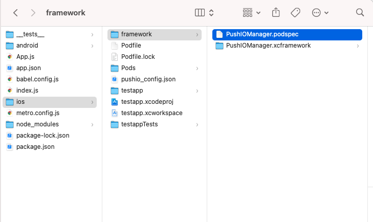
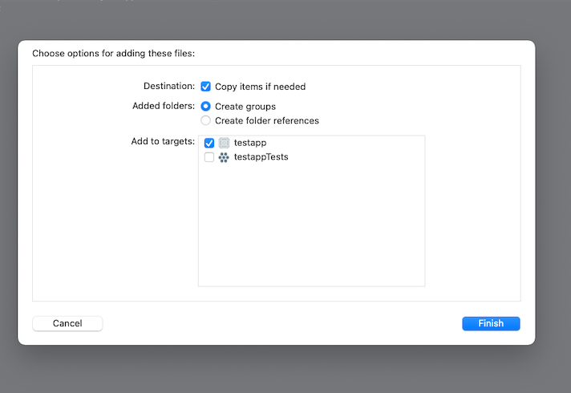

# Example React Native iOS Implementation for Responsys SDK

This is the example implementation for iOS of PushIOManager SDK with  React Native.

## Requirements

- PushIOManager.frameowk - [download latest SDK from here](https://www.oracle.com/downloads/applications/cx/responsys-mobile-sdk.html)
- pushio_config.json or pushio_debug_config.json - download from the Mobile Developer Console. Follow [Step 1 of this guide](https://docs.oracle.com/en/cloud/saas/marketing/responsys-develop-mobile/ios/step-by-step.htm). 


## 1. Install PushIOManager React Native module
Create new react app or go to existing app.
```
cd <your_react_native_app>
// Install the pushiomanager react native module
yarn add @oracle/react-native-pushiomanager // or npm install @oracle/react-native-pushiomanager
```

## 2. Setup PushIOManager framework installation
Run the below commands after installing the react-native-pushiomanager module 

```
//Create Framework directory
mkdir ios/framework

//Copy the podspec file in the framework directory. **This step is crucial**
cp node_modules/@oracle/react-native-pushiomanager/PushIOManager/PushIOManager.podspec  ios/framework/
```

Place the [latest iOS `PushIOManager.xcframework`](https://www.oracle.com/downloads/applications/cx/responsys-mobile-sdk.html) inside `ios/framework`

After above these steps your framework directory should look like this.




## 3. Add PushIOManager dependency to Podfile

Go to iOS directory in your react native app. Open the `Podfile`

```
use_native_modules!
pod 'PushIOManager', :path => './framework/'
```


Sample Podfile after adding PushIOManager dependenct look like this.

**Note:** This depends on the your react native version. Verify the PushIOManager setup.

<pre>

require_relative '../node_modules/react-native/scripts/react_native_pods'
require_relative '../node_modules/@react-native-community/cli-platform-ios/native_modules'

platform :ios, '11.0'

target 'testapp' do
  config = use_native_modules!

  use_react_native!(
    :path => config[:reactNativePath],
    # to enable hermes on iOS, change `false` to `true` and then install pods
    :hermes_enabled => false
  )

  target 'testappTests' do
    inherit! :complete
    # Pods for testing
  end

  # Enables Flipper.
  #
  # Note that if you have use_frameworks! enabled, Flipper will not work and
  # you should disable the next line.
  use_flipper!()
  
  <b style="color:green"><i style="background:lightcyan">use_native_modules!
  pod 'PushIOManager', :path => './framework/'</i></b>

  post_install do |installer|
    react_native_post_install(installer)
    __apply_Xcode_12_5_M1_post_install_workaround(installer)
  end
end

</pre>

## 4. Install Pods
```
//iOS directory in your react native app
cd ios 
pod install
```

## 5. Copy pushio.config.json

Download your **iOS** `pushio_config.json` from [Responsys Mobile App Developer Console](https://docs.oracle.com/en/cloud/saas/marketing/responsys-develop-mobile/dev-console/login/).

Open your iOS project `<react-native-app-path>/ios/<project-name>.xcworkspace` in Xcode.

Drag and Drop the `pushio_config.json` in **Xcode** in your `<react-native-test-app-name>` directory

Please make sure to select **`<Your App Target>`** in "Add to Targets" and also "Copy items if needed".




## 5. Implementing Delegate Methods:

Please make sure to implement the **Bold** code parts in your `AppDelegate.m`.


<pre language="objective-c" autocomplete="off" autocorrect="off" autocapitalize="off" spellcheck="false">
<code>
//Appdelegate.m

#import "AppDelegate.h"

#import &ltReact/RCTBridge.h&gt
#import &ltReact/RCTBundleURLProvider.h&gt
#import &ltReact/RCTRootView.h&gt

#ifdef FB_SONARKIT_ENABLED
#import &ltFlipperKit/FlipperClient.h&gt
#import &ltFlipperKitLayoutPlugin/FlipperKitLayoutPlugin.h&gt
#import &ltFlipperKitUserDefaultsPlugin/FKUserDefaultsPlugin.h&gt
#import &ltFlipperKitNetworkPlugin/FlipperKitNetworkPlugin.h&gt
#import &ltSKIOSNetworkPlugin/SKIOSNetworkAdapter.h&gt
#import &ltFlipperKitReactPlugin/FlipperKitReactPlugin.h&gt

<b style="color:green;background:lightcyan;">
//Import Framework
#import &ltPushIOManager/PushIOManager.h&gt
//For UserNotifications support
#import &ltUserNotifications/UserNotifications.h&gt

//Implement UserNotifications delegate to receive the notification callbacks in iOS 10.
@interface AppDelegate()&ltUNUserNotificationCenterDelegate&gt
@end
</b>

static void InitializeFlipper(UIApplication *application) {
  FlipperClient *client = [FlipperClient sharedClient];
  SKDescriptorMapper *layoutDescriptorMapper = [[SKDescriptorMapper alloc] initWithDefaults];
  [client addPlugin:[[FlipperKitLayoutPlugin alloc] initWithRootNode:application withDescriptorMapper:layoutDescriptorMapper]];
  [client addPlugin:[[FKUserDefaultsPlugin alloc] initWithSuiteName:nil]];
  [client addPlugin:[FlipperKitReactPlugin new]];
  [client addPlugin:[[FlipperKitNetworkPlugin alloc] initWithNetworkAdapter:[SKIOSNetworkAdapter new]]];
  [client start];
}
#endif

@implementation AppDelegate

- (BOOL)application:(UIApplication *)application didFinishLaunchingWithOptions:(NSDictionary *)launchOptions
{
  
  
#ifdef FB_SONARKIT_ENABLED
  InitializeFlipper(application);
#endif

  RCTBridge *bridge = [[RCTBridge alloc] initWithDelegate:self launchOptions:launchOptions];
  RCTRootView *rootView = [[RCTRootView alloc] initWithBridge:bridge
                                                   moduleName:@"testapp"
                                            initialProperties:nil];
 `#f03c15`
  if (@available(iOS 13.0, *)) {
      rootView.backgroundColor = [UIColor systemBackgroundColor];
  } else {
      rootView.backgroundColor = [UIColor whiteColor];
  }

  self.window = [[UIWindow alloc] initWithFrame:[UIScreen mainScreen].bounds];
  UIViewController *rootViewController = [UIViewController new];
  rootViewController.view = rootView;
  self.window.rootViewController = rootViewController;
  [self.window makeKeyAndVisible];
  <b style="color:green">

  // Responsys implementation 
  [UNUserNotificationCenter currentNotificationCenter].delegate = self;
  
  //To recieve the notifications in App foreground
  [PushIOManager sharedInstance].notificationPresentationOptions = UNNotificationPresentationOptionAlert | UNNotificationPresentationOptionBadge | UNNotificationPresentationOptionSound;

  // Call the didFinishLaunching of SDK at end.
  [[PushIOManager sharedInstance] didFinishLaunchingWithOptions:launchOptions];
  </b>
  return YES;
}

- (NSURL *)sourceURLForBridge:(RCTBridge *)bridge
{
#if DEBUG
  return [[RCTBundleURLProvider sharedSettings] jsBundleURLForBundleRoot:@"index" fallbackResource:nil];
#else
  return [[NSBundle mainBundle] URLForResource:@"main" withExtension:@"jsbundle"];
#endif
}

<b style="color:green;background:lightcyan;">
- (void)application:(UIApplication *)application didRegisterForRemoteNotificationsWithDeviceToken:(NSData *)deviceToken {
  [[PushIOManager sharedInstance] didRegisterForRemoteNotificationsWithDeviceToken:deviceToken];
}

- (void)application:(UIApplication *)application didReceiveRemoteNotification:(NSDictionary *)userInfo
fetchCompletionHandler:(void (^)(UIBackgroundFetchResult))completionHandler {
  [[PushIOManager sharedInstance] didReceiveRemoteNotification:userInfo fetchCompletionResult:UIBackgroundFetchResultNewData fetchCompletionHandler:completionHandler];
}

- (void)application:(UIApplication *)application didFailToRegisterForRemoteNotificationsWithError:(NSError *)error {
    [[PushIOManager sharedInstance] didFailToRegisterForRemoteNotificationsWithError:error];
}

- (BOOL)application:(UIApplication *)app openURL:(NSURL *)url options:(NSDictionary<UIApplicationOpenURLOptionsKey,id> *)options {
   [[PushIOManager sharedInstance] openURL:url options:options];
  return YES;
}

//iOS 10 or later
- (void)userNotificationCenter:(UNUserNotificationCenter *)center didReceiveNotificationResponse:(UNNotificationResponse *)response withCompletionHandler:(void(^)(void))completionHandler {

    [[PushIOManager sharedInstance] userNotificationCenter:center didReceiveNotificationResponse:response withCompletionHandler:completionHandler];
}

-(void) userNotificationCenter:(UNUserNotificationCenter *)center willPresentNotification:
(UNNotification *)notification withCompletionHandler:(void (^)(UNNotificationPresentationOptions options))completionHandler {
    [[PushIOManager sharedInstance] userNotificationCenter:center willPresentNotification:notification withCompletionHandler:completionHandler];
}

- (BOOL)application:(UIApplication *)app openURL:(NSURL *)url options:(NSDictionary<UIApplicationOpenURLOptionsKey,id> *)options {
    [[PushIOManager sharedInstance] openURL:url options:options];
   return YES;
}
</b>

@end
</code>
</pre>


### Usage

The module can be accessed in JS code as follows,

```javascript
import PushIOManager from 'react-native-pushiomanager';
```


### Configure And Register

- Configure the SDK,

	```javascript
	PushIOManager.configure("your-pushio_config_name.json", (error, response) => {
	      
	});
	```
	
- Once the SDK is configured, register the app with Responsys,

	```javascript
	import { Platform } from 'react-native';
	
	if (Platform.OS === 'android') {
		PushIOManager.registerApp(true, (error, response) => {
        });
	} else {
		PushIOManager.registerForAllRemoteNotificationTypes((error, response) => { //This api will raise iOS push permission alert                 
        	PushIOManager.registerApp(false, (error, response) => {			
			});  
		});
	}
    ```
- **Combination of above steps**
	```javascript
	import { Platform } from 'react-native';

	PushIOManager.configure("your-pushio_config_name.json", (error, response) => { // Configure the SDK with config provided
	  if (Platform.OS === 'android') {
	      PushIOManager.registerApp(true, (error, response) => { //Register for android
                
          });
	  } else {
		  PushIOManager.registerForAllRemoteNotificationTypes((error, response) => { //This api will raise iOS push permission alert                 
              PushIOManager.registerApp(false, (error, response) => { //Register for iOS. `useLocation` is not supported in iOS.

		      });  
		  });
	 }
	      
	});

- Additional APIs (optional)

    iOS Only:
    - You can delay registration while app is launching or coming to foreground by implementing below API.
   ```
   // Implement before `registerForAllRemoteNotificationTypes` calls.
   PushIOManager.setDelayRegistration(true); 
   ```


## Support

If you have access to My Oracle Support, please raise a request [here](http://support.oracle.com/), otherwise open an issue in this repository. 


## License

Copyright (c) 2020 Oracle and/or its affiliates and released under the Universal Permissive License (UPL), Version 1.0.

Oracle and Java are registered trademarks of Oracle and/or its affiliates. Other names may be trademarks of their respective owners.
